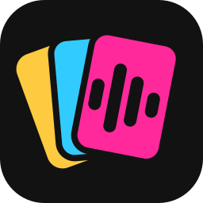
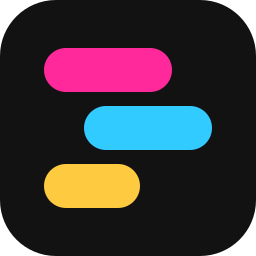
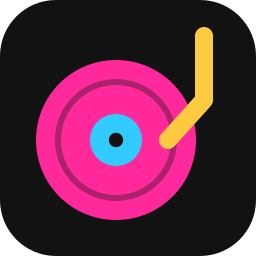

# Song Deck — Brand & Visual Identity

The studio's look in one page: palette and the job each colour does, the design tokens for both
themes, contrast guarantees, the logo, fonts and the track palette. Tokens live in
`apps/studio/src/styles/theme.css`; `apps/studio/test/theme-contrast.test.ts` keeps them honest.

## 1. Palette and roles

| Colour | Hex | Role |
| --- | --- | --- |
| Pink | `#ff299c` | **Primary accent.** Primary buttons, playhead, focus ring, selected tabs and chips, the active mode. |
| Blue | `#32cbff` | **The AI colour.** AI proposals, suggestions, AI buttons, model/provider and capability badges, AI progress. Nothing else is blue. |
| Yellow | `#fdca40` | **Locks and warnings.** Lock buttons and overlays, mute, warnings, low-confidence notes, the limiter. |
| Gray | `#4c4c4c` | Strong borders and dividers (dark theme), muted text (light theme). |
| Gray (light) | `#636363` | Fader caps and secondary borders (dark theme), dim text (light theme). |

Rules of thumb:

- **Pink fills carry dark text** (`--on-accent`, #1a000e). White on #ff299c is only 3.47:1 and
  fails WCAG AA for normal text. Pink *text* uses `--accent-text`: a lighter #ff5cb5 on dark
  surfaces, a deeper #c2006f on light ones.
- **Blue means AI.** If a control is not about an AI model or an AI proposal, it is not blue.
  Secondary mixer controls (sends, ceiling, compressor) are neutral; A/B selection is pink.
- **Yellow means "careful" or "frozen".** Use it for locks and warnings, never for decoration.
- Success green and danger red stay as functional status colours outside the brand palette.

## 2. Design tokens

Dark is the default; `:root[data-theme='light']` overrides. Surfaces are neutral grays derived
from the brand grays (no blue tint). In the light theme, text tones of pink, blue and yellow get
deeper while fills keep the bright brand colours with dark text.

| Token | Dark | Light | Used for |
| --- | --- | --- | --- |
| `--bg` | `#121212` | `#f2f2f2` | App background, editor canvases |
| `--bg-elev-1` | `#191919` | `#ffffff` | Bars, panels, side panes |
| `--bg-elev-2` | `#202020` | `#f7f7f7` | Cards, buttons |
| `--bg-elev-3` | `#2a2a2a` | `#ebebeb` | Hover, active tabs, neutral badges |
| `--bg-input` | `#0e0e0e` | `#ffffff` | Inputs, tab rails, meters |
| `--border` / `--border-strong` | `#2f2f2f` / `#4c4c4c` | `#dcdcdc` / `#bdbdbd` | Dividers / control borders |
| `--text` / `--text-muted` / `--text-dim` | `#ededed` / `#b4b4b4` / `#959595` | `#161616` / `#4c4c4c` / `#636363` | Body / secondary / tertiary text |
| `--accent` | `#ff299c` | `#ff299c` | Pink fills, borders, playhead, focus ring |
| `--accent-strong` | `#ff52b0` | `#ff4dab` | Primary button hover |
| `--accent-text` | `#ff5cb5` | `#c2006f` | Pink text and icons |
| `--accent-soft` / `--accent-line` | pink at 15% / 50% | pink at 11% / 55% | Selected backgrounds / outlines |
| `--on-accent` | `#1a000e` | `#1a000e` | Text on pink fills |
| `--ai` | `#32cbff` | `#0071a1` | AI text, icons, outlines |
| `--ai-fill` / `--on-ai` | `#32cbff` / `#00161f` | `#32cbff` / `#00161f` | Solid AI-blue fills and their text |
| `--ai-soft` / `--ai-line` | blue at 13% / 45% | blue at 16% / deep blue at 45% | AI badges and buttons |
| `--warning`, `--lock` | `#fdca40` | `#8a6100` | Warning/lock text and icons |
| `--warning-fill` / `--on-warning` | `#fdca40` / `#1f1600` | `#fdca40` / `#1f1600` | Solid yellow fills (mute) |
| `--success` / `--danger` | `#3ecf8e` / `#ff6b61` | `#0f7049` / `#b82a2a` | Status |
| `--playhead` | `#ff299c` | `#ff299c` | Playhead in every timeline |
| `--focus-ring` | 2px `--accent` | 2px `--accent` | `:focus-visible` |
| `--key-white` / `--key-black` / `--key-label` | `#d6d6d6` / `#1c1c1c` / `#4c4c4c` | `#ffffff` / `#3a3a3a` / `#636363` | Piano-roll keyboard |
| `--on-track` | `#121212` | `#121212` | Text drawn on track-coloured notes and avatars |

Tints are written as `color-mix(in srgb, var(--token) N%, transparent)` so they follow the theme.
Canvas views (piano roll, note strips, EQ, compressor, automation, waveforms) read the tokens with
`getComputedStyle` (`apps/studio/src/ui/theme.ts`) and redraw when the theme changes.

## 3. Contrast

WCAG AA: 4.5:1 for normal text, 3:1 for large text and UI components (focus ring, playhead,
icons, indicators). `theme-contrast.test.ts` parses `theme.css`, composites translucent fills over
the surfaces they sit on, and fails CI if any pair below drops under its minimum. Each row shows
the lowest ratio across the surfaces checked (regenerate with
`npx tsx apps/studio/test/contrast-table.ts`).

| Foreground | Background | Use | AA min | Dark: lowest | Light: lowest |
| --- | --- | --- | --- | --- | --- |
| `--text` | all five surfaces | text on surfaces | 4.5:1 | 12.26 (bg-elev-3) | 15.18 (bg-elev-3) |
| `--text-muted` | all five surfaces | text on surfaces | 4.5:1 | 6.92 (bg-elev-3) | 7.20 (bg-elev-3) |
| `--text-dim` | all five surfaces | text on surfaces | 4.5:1 | 4.79 (bg-elev-3) | 5.04 (bg-elev-3) |
| `--accent-text` | all five surfaces | text on surfaces | 4.5:1 | 5.09 (bg-elev-3) | 5.00 (bg-elev-3) |
| `--ai` | all five surfaces | text on surfaces | 4.5:1 | 7.60 (bg-elev-3) | 4.54 (bg-elev-3) |
| `--success` | all five surfaces | text on surfaces | 4.5:1 | 7.19 (bg-elev-3) | 5.13 (bg-elev-3) |
| `--danger` | all five surfaces | text on surfaces | 4.5:1 | 5.15 (bg-elev-3) | 5.18 (bg-elev-3) |
| `--warning` | all five surfaces | text on surfaces | 4.5:1 | 9.36 (bg-elev-3) | 4.65 (bg-elev-3) |
| `--accent-text` | `--accent-soft` over elev-1/elev-2/input | badges, chips, selected tabs | 4.5:1 | 4.98 (bg-elev-2) | 4.80 (bg-elev-2) |
| `--ai` | `--ai-soft` over elev-1/elev-2/input | badges, chips, selected tabs | 4.5:1 | 6.67 (bg-elev-2) | 4.57 (bg-elev-2) |
| `--success` | `--success-soft` over elev-1/elev-2/input | badges | 4.5:1 | 6.21 (bg-elev-2) | 4.95 (bg-elev-2) |
| `--danger` | `--danger-soft` over elev-1/elev-2/input | badges | 4.5:1 | 4.75 (bg-elev-2) | 5.01 (bg-elev-2) |
| `--warning` | `--warning-soft` over elev-1/elev-2/input | badges | 4.5:1 | 7.82 (bg-elev-2) | 4.76 (bg-elev-2) |
| `--on-accent` | `--accent` | primary button | 4.5:1 | 5.76 | 5.76 |
| `--on-accent` | `--accent-strong` | primary button (hover) | 4.5:1 | 6.75 | 6.57 |
| `--on-ai` | `--ai-fill` | solo toggle | 4.5:1 | 9.80 | 9.80 |
| `--on-warning` | `--warning-fill` | mute toggle | 4.5:1 | 11.68 | 11.68 |
| `--accent` / `--playhead` | `--bg`, elev-1, elev-2 | focus ring, playhead, indicators | 3:1 | 4.69 (bg-elev-2) | 3.10 (bg) |
| `--lock` / `--warning` | `--bg`, elev-1, elev-2 | lock icons, warnings | 3:1 | 10.63 (bg-elev-2) | 4.95 (bg) |
| `--ai` | `--bg`, elev-1, elev-2 | AI icons and outlines | 3:1 | 8.63 (bg-elev-2) | 4.84 (bg) |

For reference, white on brand pink is 3.47:1 (fails AA text), which is why pink buttons use
`--on-accent`. Borders are separators, not information carriers, and are not held to 3:1;
every control also has a label and the pink focus ring.

## 4. Logo

Three directions live in `docs/brand/` as standalone SVGs on a 64×64 grid, each with a wordmark
lockup (`-lockup.svg`, "Song Deck" in Inter Bold converted to outlines, so it renders without the
font; the wordmark switches to light text under `prefers-color-scheme: dark`).

| | Mark | Idea |
| --- | --- | --- |
| **A — Fanned deck** (chosen) |  | A hand of three cards in yellow, blue and pink; the front card carries a waveform. Literally a *deck* of songs, and the waveform keeps the old four-bar mark's equaliser. |
| B — Stacked lanes |  | Three offset clips like arrangement lanes, stacked like a deck seen edge-on. The crispest at 16 px, but closer to a generic "list" glyph. |
| C — Record deck |  | A pink record with a blue label and a yellow tonearm: "deck" as a playback deck. Friendly, but says "player" more than "composition". |

Direction A is implemented as `BrandMark` (`apps/studio/src/ui/icons.tsx`) and the favicon
(`apps/studio/public/favicon.svg`). Usage:

- Always on its ink tile (`#121212`, 14/64 corner radius); the tile is what keeps the colours
  legible on light and dark surfaces. Don't recolour the cards or theme the mark.
- Minimum size 16 px (favicon); 22 px in the top bar. Keep clear space of a quarter of the mark's
  width around it. In the lockup the wordmark sits 16/64 of the mark's width to its right.
- App icons in `apps/studio/public/` are rendered from the SVG with headless Chromium:
  `favicon-32.png`, `apple-touch-icon.png` (180 px, full bleed), `icon-192.png`, `icon-512.png`
  and `icon-maskable-512.png` (art inside the 80% safe zone), listed in `manifest.webmanifest`.

## 5. Fonts

- **Inter** (variable, `@fontsource-variable/inter`) for all UI text: `--font-ui`.
- **JetBrains Mono** (variable, `@fontsource-variable/jetbrains-mono`) for numbers, time and code:
  `--font-mono` (with tabular figures).

Both are studio dependencies imported in `apps/studio/src/main.tsx`, so they are bundled into the
build and work offline. Canvas text uses the same stacks via the CSS variables.

## 6. Track palette

`packages/core/src/ir/palette.ts` (`TRACK_PALETTE`, `ROLE_COLORS`, `STEM_COLORS`). Twelve hues
spaced around the wheel and tuned to the brand pink's contrast: about 5.4:1 on the dark editor
background and at least 3:1 on the light one, so notes and clips read alike in both themes (the
contrast test checks every entry). Composed, imported, rebuilt and plugin tracks all use it.

| # | Colour | Hex | Role | Stem group |
| --- | --- | --- | --- | --- |
| 0 | Pink (brand) | `#ff299c` | vocal | vocals |
| 1 | Coral | `#ee554c` | drums | drums |
| 2 | Orange | `#de6907` | percussion | |
| 3 | Gold | `#b38007` | bass | bass |
| 4 | Olive | `#8f8f0b` | rhythm-guitar | guitars |
| 5 | Green | `#0ca02d` | lead-guitar | |
| 6 | Teal | `#019d7e` | keys | keys |
| 7 | Cyan | `#03999d` | synth-seq | |
| 8 | Blue | `#0b95c0` | strings | strings |
| 9 | Azure | `#3587fb` | synth-pad | |
| 10 | Violet | `#8778fc` | synth-arp | |
| 11 | Orchid | `#bb65df` | synth-lead | |
| | Neutral | `#858585` | custom | others |

Section colours (arrangement header, automation ruler; `apps/studio/src/ui/theme.ts`) reuse the
palette: verse blue, pre-chorus gold, chorus and final chorus pink, post-chorus orchid, bridge
violet, breakdown teal, build orange, drop coral, solo green, interlude cyan, intro/outro neutral.
Collaborator avatars use the palette without the pink, which marks your own selection.

## 7. Screenshots

`docs/brand/screenshots/` shows the result in both themes and at phone width (390 px). Regenerate
with `node apps/studio/scripts/screenshots.mjs` (`--all` also visits every mode at phone and tablet
width and reports anything that overflows the page).
